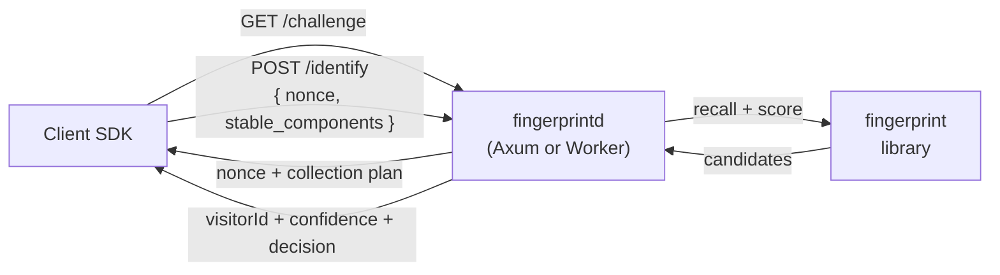

# fingerprintd

[English](./README.md) | [简体中文](./README.zh-CN.md)

Device fingerprinting where the **server**, not the browser, decides who you are. The client only gathers evidence; the server issues a one-time challenge, fuzzy-matches the evidence against its fingerprint library, and returns a `visitorId` you can trust. The identity is never computed on the client, so it can't be forged or replayed.

```diff
- const visitorId = await fingerprint()          // computed in the browser → forgeable, replayable
+ const { identity } = await run({ baseUrl, collect })
+ // identity.visitorId  ← computed server-side from a one-time challenge → authoritative
```

## Why

Client-side fingerprinting hands the attacker the algorithm. Whatever the browser computes, a determined script can recompute, pin, or replay — so the "stable id" you gate signups and checkouts on is only as honest as the client chooses to be.

fingerprintd moves the decision to the server:

- **Server-authoritative identity** — the client submits raw signals (canvas, WebGL, fonts, audio, UA…); the server derives the `visitorId`. A forged client can lie about a signal, but it can't mint an identity.
- **One-time challenge, burned on use** — every `/identify` spends a short-lived nonce, so a captured request can't be replayed.
- **Fuzzy matching, not a hash** — a browser upgrade or one font change shouldn't fork a device into a new identity, and two similar devices shouldn't collide. A two-stage recall + probabilistic score handles the drift.
- **Cross-checks it can't forge** — the server compares the client's self-reported UA against the network-layer TLS fingerprint (JA4) and IP risk it observed itself. Self-report vs. observed disagreement is a bot signal the client never controls.
- **One engine, two deployments** — the same compute core runs as a native [Axum server](crates/fingerprintd) and as a [Cloudflare Worker](apps/edge). A client works against either unchanged.

It deliberately does **not** claim unbreakable defense — a sufficiently advanced adversary can forge any single signal. Its value is raising the cost of forgery and cross-checking multiple signals for consistency. It is an anti-fraud tool for high-risk actions (login, signup, checkout, coupon redemption), **not** a cross-site tracker.

## How it works

```
1. GET /challenge          server mints a one-time nonce (short TTL, single-use)
                           and returns it plus the collection plan

2. client collects         stable_components — canvas / webgl / fonts / audio / UA …
                           (NO nonce mixed in)        → the identity-matching input
                           probe — hex(HMAC-SHA256(key, nonce)) computed in WASM
                                                       → a freshness proof, never a matching signal

3. POST /identify          server: burn the nonce (replay protection)
   { nonce,                        → blocking-key recall → Fellegi–Sunter score
     stable_components,            → fuse passive JA4 / IP signals (UA↔TLS consistency)
     probe?, ts? }         → visitorId + confidence + decision (+ passive signals)
```



The `probe` proves the request is fresh; it is **never** used to match identity — a deliberate split so a leaked probe key can't move the identity decision. Passive JA4/IP signals are read from the connection server-side and are never accepted from the client body.

## Endpoints

Both deployments serve the same wire contract.

| Endpoint        | Method | Purpose                                           |
| --------------- | ------ | ------------------------------------------------- |
| `/health`       | GET    | Liveness (`200 OK`)                               |
| `/challenge`    | GET    | Issue a one-time nonce challenge                  |
| `/identify`     | POST   | Compute `visitorId` + `confidence` + `decision`   |
| `/visitor/{id}` | DELETE | GDPR erasure — remove a visitor (admin-key gated) |

`/identify` returns `{ visitorId, confidence, is_new_device, decision, collision_risk, signals }`. `decision` is one of `match` / `review` / `new_device`; `confidence` is a decision confidence in `[0,1]`, not identity trust (a brand-new device can score high yet be entirely unestablished — key trust off `is_new_device` / `decision`).

## Quick start

Run the native server (listens on `127.0.0.1:8080` by default):

```bash
cargo run -p fingerprintd

# override the bind address
FINGERPRINTD_BIND_ADDR=0.0.0.0:9000 cargo run -p fingerprintd

# probe liveness
curl -i http://127.0.0.1:8080/health
```

Log level is controlled by `RUST_LOG` (defaults to `info`).

Call it from a browser with the SDK — it integrates FingerprintJS + BotD, computes the nonce probe in WASM, and submits. It never derives an id:

```ts
import { createCollector, run } from '@cdlab/fingerprintd-client'

const { identity } = await run({
  baseUrl: 'https://fp.example.com',
  collect: createCollector(),
})
// identity: { visitorId, confidence, decision, is_new_device, collision_risk, signals }
```

## Deployment targets

One compute core ([`crates/fp-core`](crates/fp-core), compiled to WASM via [`crates/fp-wasm`](crates/fp-wasm)) backs every target, so the identity decision is identical across them:

- **Native server** — [`crates/fingerprintd`](crates/fingerprintd), an Axum service with an in-memory store. Start here for self-hosting.
- **Serverless edge** — [`apps/edge`](apps/edge/README.md), a Cloudflare Worker with a Durable Object nonce store and a D1 fingerprint library.
- **Playground** — [`apps/web`](apps/web/README.md) drives the whole flow in a browser and visualizes what the client sends vs. what the server judges.
- **Check-in risk decision** — the edge Worker also serves `POST /checkin/assess`, a config-gated layer that adds the account/device/IP/time aggregation fingerprintd deliberately doesn't hold and turns a verdict into an allow / challenge / deny decision for daily check-in anti-farming; the [playground](apps/web/README.md) demos it.

CI deploys via the manual `deploy-edge` / `deploy-web` workflows. To deploy **from your machine** (rebuild WASM from source → build → push to Cloudflare), use `bun run deploy:cf [edge|web|all]`:

```bash
DRY_RUN=1 bun run deploy:cf edge          # build + wrangler dry-run, no account needed
FP_PROBE_KEY=<key> bun run deploy:cf all   # real deploy (wrangler login or CLOUDFLARE_API_TOKEN)
```

`FP_PROBE_KEY` is baked into the WASM; for a probe-enforced deploy it must equal the Worker's runtime `FP_PROBE_KEY` secret. Runtime secrets are managed separately with `wrangler secret put`.

## Configuration

The native server is configured lowest → highest priority: built-in defaults → `fingerprintd.toml` → `FINGERPRINTD_`-prefixed environment variables.

| Key                          | Env var                                   | Default          | Meaning                                                                     |
| ---------------------------- | ----------------------------------------- | ---------------- | --------------------------------------------------------------------------- |
| `bind_addr`                  | `FINGERPRINTD_BIND_ADDR`                  | `127.0.0.1:8080` | Listen address.                                                             |
| `nonce_ttl_secs`             | `FINGERPRINTD_NONCE_TTL_SECS`             | `30`             | One-time nonce lifetime, advertised as `expires_in`.                        |
| `trust_edge_headers`         | `FINGERPRINTD_TRUST_EDGE_HEADERS`         | `false`          | Trust edge-injected passive-signal headers (JA4/IP). **Fail-closed:** enable only behind a trusted edge; a directly-reachable origin must leave it off. |
| `probe_key`                  | `FINGERPRINTD_PROBE_KEY`                  | *(unset)*        | HMAC key enabling nonce-probe verification (defense in depth). Off if unset. |
| `response_signing_key`       | `FINGERPRINTD_RESPONSE_SIGNING_KEY`       | *(unset)*        | HMAC key enabling `/identify` response signatures. Off if unset.            |
| `enforce_ts_window`          | `FINGERPRINTD_ENFORCE_TS_WINDOW`          | `false`          | Enforce the request timestamp window.                                       |
| `ts_skew_secs`               | `FINGERPRINTD_TS_SKEW_SECS`               | `30`             | Allowed clock skew when the window is on.                                   |
| `admin_key`                  | `FINGERPRINTD_ADMIN_KEY`                  | *(unset)*        | Bearer key gating `DELETE /visitor/{id}`. Erasure is disabled if unset.     |
| `retention_secs`             | `FINGERPRINTD_RETENTION_SECS`             | `0`              | Evict stored records past this age (seconds). `0` disables the sweep.       |
| `fuzzy_max_records`          | `FINGERPRINTD_FUZZY_MAX_RECORDS`          | `1000000`        | Max distinct visitors; oldest-seen is evicted over cap.                     |
| `fuzzy_record_ttl_secs`      | `FINGERPRINTD_FUZZY_RECORD_TTL_SECS`      | `0`              | Evict records not seen within this window. `0` disables the TTL.            |
| `fuzzy_max_block`            | `FINGERPRINTD_FUZZY_MAX_BLOCK`            | `1024`           | Per-block visitor cap for the blocking index; over-cap inserts are dropped. |
| `fuzzy_max_frequency_values` | `FINGERPRINTD_FUZZY_MAX_FREQUENCY_VALUES` | `1000000`        | Cap on distinct tracked frequency values; new values over cap drop.         |

The `probe_key` / `response_signing_key` / `admin_key` controls are **fail-closed and off by default** — a control activates only once its key is set. The in-memory capacity bounds are generous and fail-safe: a small workload behaves exactly like an unbounded store, and every eviction or drop is counted, never silent. These bounds apply to the native server only; the stateless edge is per-request.

## Project structure

```
crates/
  fp-core/          framework-free compute + storage traits (the shared engine)
  fingerprintd/     native Axum server (challenge / identify / erasure)
  fp-wasm/          Rust→WASM probe core + edge engine
packages/
  client/           TypeScript browser SDK (FingerprintJS/BotD + collector)
apps/
  edge/             Cloudflare Worker: /identify + /checkin/assess (WASM engine + Durable Object/D1)
  web/              React/Vite playground for the challenge / identify / check-in flow
DESIGN.md           architecture + fuzzy-matching spec (bilingual)
```

`crates/fingerprintd/src/lib.rs` exposes `build_router() -> axum::Router`, the single place HTTP routes are mounted.

## Build & quality gate

The full green bar (run from the workspace root):

```bash
cargo fmt --all -- --check
cargo clippy --all-targets --all-features -- -D warnings
cargo nextest run --all-features          # or: cargo test --all-features
cargo build --all-targets
cargo deny check
```

The deny-warnings policy lives in `[workspace.lints]`; CI runs the same commands plus the SDK and Worker suites (`.github/workflows/`). The Rust and TypeScript stacks are held to one behavior by a shared **parity fixture** exercised on both sides (see [`apps/edge/README.md`](apps/edge/README.md)).

> **Vendored WASM.** `apps/edge/wasm` and `packages/client/wasm` are build outputs of [`crates/fp-wasm`](crates/fp-wasm) and are **not committed** — they're rebuilt from source on demand (only on a fresh clone or after `bun run clean`; a normal install never recompiles).
>
> - With a **Rust toolchain + `wasm-pack`** installed, a plain `bun install` builds them automatically:
>
>   ```bash
>   bun install   # builds the WASM (if missing) + the SDK
>   ```
>
> - **Without** the Rust toolchain, install still succeeds but skips the SDK prebuild — build the WASM once the toolchain is available:
>
>   ```bash
>   bun run build:wasm   # wasm-pack build crates/fp-wasm -> apps/edge/wasm + packages/client/wasm
>   bun run build        # then builds the SDK + apps
>   ```
>
> Install `wasm-pack` with `cargo install wasm-pack`.

Per-component tooling:

- **SDK** — `cd packages/client && bun run lint && bun run typecheck && bun run test`
- **Edge Worker** — `cd apps/edge && bun run test` (identify + check-in: router / state / parity / assess in miniflare)
- **Playground** — `cd apps/web && bun run typecheck && bun run build`

## Design

[`DESIGN.md`](DESIGN.md) ([中文](DESIGN.zh-CN.md)) is the authoritative spec: the architecture (background, threat model, the freshness-vs-identity split, the passive-signal trust boundary, HTTP contract, privacy and compliance, deployment targets) and the fuzzy-matching engine (two-stage blocking + Fellegi–Sunter scoring, drift, cold start, offline evaluation).

## Security

See [`SECURITY.md`](SECURITY.md) for the vulnerability-reporting policy. The probe and response-signing keys shipped in client WASM/JS are **defense in depth, not a decisive control** — the one-time nonce and TLS remain the primary guarantees.

## License

[Apache-2.0](LICENSE)
