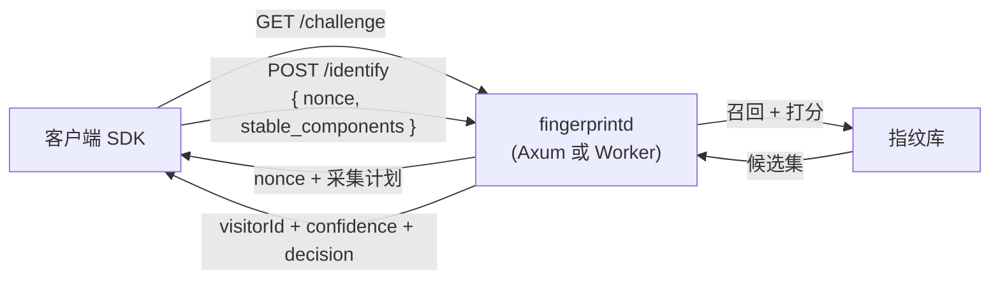

# fingerprintd

[English](./README.md) | [简体中文](./README.zh-CN.md)

由**服务端**、而非浏览器决定"你是谁"的设备指纹服务。客户端只负责采集证据;服务端签发一次性 challenge、把证据与指纹库做模糊匹配,返回一个可信的 `visitorId`。身份从不在客户端计算,因此无法被伪造或重放。

```diff
- const visitorId = await fingerprint()          // 在浏览器里计算 → 可伪造、可重放
+ const { identity } = await run({ baseUrl, collect })
+ // identity.visitorId  ← 由一次性 challenge 在服务端计算 → 权威可信
```

## 为什么

客户端指纹等于把算法交到攻击者手里。浏览器算出来的任何东西,一个有心的脚本都能重算、固定或重放 —— 于是你用来把关注册和下单的那个"稳定 id",只在客户端愿意诚实时才可信。

fingerprintd 把判定搬到服务端:

- **服务端权威身份** —— 客户端提交原始信号(canvas、WebGL、字体、音频、UA…),由服务端派生 `visitorId`。伪造的客户端能在某个信号上撒谎,但铸造不出一个身份。
- **一次性 challenge,用后即焚** —— 每次 `/identify` 都消耗一个短时效 nonce,被截获的请求无法重放。
- **模糊匹配,而非哈希** —— 浏览器升级或换一个字体不该把一台设备分裂成新身份,两台相似设备也不该相撞。两阶段召回 + 概率打分吸收这种漂移。
- **它伪造不了的交叉校验** —— 服务端把客户端自报的 UA 与它**自己观测到**的网络层 TLS 指纹(JA4)和 IP 风险对比。自报与实测的不一致,是客户端控制不了的机器人信号。
- **一个引擎,两种部署** —— 同一个计算核心既作为原生 [Axum 服务](crates/fingerprintd)运行,也作为 [Cloudflare Worker](apps/edge) 运行。客户端对两者无感切换。

它刻意**不**宣称牢不可破 —— 足够高级的对手能伪造任意单一信号。它的价值在于**抬高伪造成本**并对多个信号做一致性交叉校验。它是用于高风险动作(登录、注册、下单、优惠券核销)的反欺诈工具,**不是**跨站追踪器。

## 工作原理

```
1. GET /challenge          服务端铸造一次性 nonce(短 TTL、单次使用),
                           连同采集计划一起返回

2. 客户端采集              stable_components —— canvas / webgl / 字体 / 音频 / UA …
                           (不掺入 nonce)              → 身份匹配的输入
                           probe —— hex(HMAC-SHA256(key, nonce)),在 WASM 中计算
                                                        → 新鲜度证明,绝不作为匹配信号

3. POST /identify          服务端:烧掉 nonce(防重放)
   { nonce,                        → blocking-key 召回 → Fellegi–Sunter 打分
     stable_components,            → 融合被动 JA4 / IP 信号(UA↔TLS 一致性)
     probe?, ts? }         → visitorId + confidence + decision(+ 被动信号)
```



`probe` 只证明请求是新鲜的;它**绝不**用于匹配身份 —— 这是刻意的拆分,好让泄露的 probe key 也无法左右身份判定。被动 JA4/IP 信号在服务端从连接层读取,**绝不**从客户端请求体接受。

## 接口

两种部署提供同一套线上契约。

| 端点            | 方法   | 用途                                              |
| --------------- | ------ | ------------------------------------------------- |
| `/health`       | GET    | 存活探测(`200 OK`)                               |
| `/challenge`    | GET    | 签发一次性 nonce challenge                        |
| `/identify`     | POST   | 计算 `visitorId` + `confidence` + `decision`      |
| `/visitor/{id}` | DELETE | GDPR 擦除 —— 删除一个 visitor(需 admin-key 门控) |

`/identify` 返回 `{ visitorId, confidence, is_new_device, decision, collision_risk, signals }`。`decision` 为 `match` / `review` / `new_device` 之一;`confidence` 是 `[0,1]` 区间的**判定置信度**,不是身份可信度(一台全新设备可以打分很高却毫无历史 —— 请以 `is_new_device` / `decision` 为准来判断可信度)。

## 快速开始

运行原生服务(默认监听 `127.0.0.1:8080`):

```bash
cargo run -p fingerprintd

# 覆盖监听地址
FINGERPRINTD_BIND_ADDR=0.0.0.0:9000 cargo run -p fingerprintd

# 探测存活
curl -i http://127.0.0.1:8080/health
```

日志级别由 `RUST_LOG` 控制(默认 `info`)。

用 SDK 从浏览器调用 —— 它集成 FingerprintJS + BotD,在 WASM 中计算 nonce probe 并提交。它从不派生 id:

```ts
import { createCollector, run } from '@cdlab/fingerprintd-client'

const { identity } = await run({
  baseUrl: 'https://fp.example.com',
  collect: createCollector(),
})
// identity: { visitorId, confidence, decision, is_new_device, collision_risk, signals }
```

## 部署目标

同一个计算核心([`crates/fp-core`](crates/fp-core),经 [`crates/fp-wasm`](crates/fp-wasm) 编译为 WASM)支撑每一个目标,因此身份判定在各处完全一致:

- **原生服务** —— [`crates/fingerprintd`](crates/fingerprintd),一个带内存存储的 Axum 服务。自托管从这里开始。
- **无服务器边缘** —— [`apps/edge`](apps/edge/README.md),一个 Cloudflare Worker,用 Durable Object 存 nonce、用 D1 存指纹库。
- **Playground** —— [`apps/web`](apps/web/README.md) 在浏览器里跑通整个流程,可视化客户端**发送**了什么、服务端**判定**了什么。
- **签到风控判定** —— edge Worker 还提供 `POST /checkin/assess`,一个 config 门控层:补上 fingerprintd 刻意不持有的账号/设备/IP/时序聚合,把一次判定转成用于每日签到反刷的 allow / challenge / deny 决策;由 [playground](apps/web/README.md) 演示。

## 配置

原生服务按优先级从低到高配置:内置默认 → `fingerprintd.toml` → `FINGERPRINTD_` 前缀的环境变量。

| 键                           | 环境变量                                  | 默认值           | 含义                                                                        |
| ---------------------------- | ----------------------------------------- | ---------------- | --------------------------------------------------------------------------- |
| `bind_addr`                  | `FINGERPRINTD_BIND_ADDR`                  | `127.0.0.1:8080` | 监听地址。                                                                  |
| `nonce_ttl_secs`             | `FINGERPRINTD_NONCE_TTL_SECS`             | `30`             | 一次性 nonce 时效,作为 `expires_in` 通告。                                 |
| `trust_edge_headers`         | `FINGERPRINTD_TRUST_EDGE_HEADERS`         | `false`          | 是否信任边缘注入的被动信号头(JA4/IP)。**Fail-closed:**仅在可信边缘之后开启;可直连的源站必须关闭。 |
| `probe_key`                  | `FINGERPRINTD_PROBE_KEY`                  | *(未设置)*       | 启用 nonce-probe 校验的 HMAC 密钥(纵深防御)。未设置则关闭。               |
| `response_signing_key`       | `FINGERPRINTD_RESPONSE_SIGNING_KEY`       | *(未设置)*       | 启用 `/identify` 响应签名的 HMAC 密钥。未设置则关闭。                       |
| `enforce_ts_window`          | `FINGERPRINTD_ENFORCE_TS_WINDOW`          | `false`          | 是否强制请求时间戳窗口。                                                    |
| `ts_skew_secs`               | `FINGERPRINTD_TS_SKEW_SECS`               | `30`             | 窗口开启时允许的时钟偏移。                                                  |
| `admin_key`                  | `FINGERPRINTD_ADMIN_KEY`                  | *(未设置)*       | 门控 `DELETE /visitor/{id}` 的 Bearer 密钥。未设置则擦除接口禁用。         |
| `retention_secs`             | `FINGERPRINTD_RETENTION_SECS`             | `0`              | 清除超过此年龄(秒)的记录。`0` 关闭清扫。                                  |
| `fuzzy_max_records`          | `FINGERPRINTD_FUZZY_MAX_RECORDS`          | `1000000`        | 最大不同 visitor 数;超上限时淘汰最早见到的。                              |
| `fuzzy_record_ttl_secs`      | `FINGERPRINTD_FUZZY_RECORD_TTL_SECS`      | `0`              | 淘汰在此窗口内未再见到的记录。`0` 关闭 TTL。                               |
| `fuzzy_max_block`            | `FINGERPRINTD_FUZZY_MAX_BLOCK`            | `1024`           | blocking 索引每块的 visitor 上限;超限的插入被丢弃。                       |
| `fuzzy_max_frequency_values` | `FINGERPRINTD_FUZZY_MAX_FREQUENCY_VALUES` | `1000000`        | 跟踪的不同频率值上限;超限的新值被丢弃。                                    |

`probe_key` / `response_signing_key` / `admin_key` 这三项控制**默认 fail-closed 且关闭** —— 只有各自的密钥被设置后才激活。内存容量上限宽松且 fail-safe:小负载表现得与无界存储完全一致,每一次淘汰或丢弃都会被计数,绝不静默。这些上限只对原生服务生效;无状态的边缘是逐请求的。

## 项目结构

```
crates/
  fp-core/          无框架的计算 + 存储 trait(共享引擎)
  fingerprintd/     原生 Axum 服务(challenge / identify / 擦除)
  fp-wasm/          Rust→WASM 的 probe 核心 + 边缘引擎
packages/
  client/           TypeScript 浏览器 SDK(FingerprintJS/BotD + 采集器)
apps/
  edge/             Cloudflare Worker:/identify + /checkin/assess(WASM 引擎 + Durable Object/D1)
  web/              challenge / identify / 签到流程的 React/Vite playground
DESIGN.md           架构 + 模糊匹配规格(双语)
```

`crates/fingerprintd/src/lib.rs` 暴露 `build_router() -> axum::Router`,是 HTTP 路由唯一的挂载点。

## 构建与质量门

完整绿条(在工作区根目录运行):

```bash
cargo fmt --all -- --check
cargo clippy --all-targets --all-features -- -D warnings
cargo nextest run --all-features          # 或:cargo test --all-features
cargo build --all-targets
cargo deny check
```

deny-warnings 策略写在 `[workspace.lints]` 里;CI 跑同样的命令,外加 SDK 与 Worker 的测试(`.github/workflows/`)。Rust 与 TypeScript 两套栈由一份共享的 **parity fixture** 在两侧同时验证,保持行为一致(见 [`apps/edge/README.md`](apps/edge/README.md))。

各组件工具链:

- **SDK** —— `cd packages/client && bun run lint && bun run typecheck && bun run test`
- **边缘 Worker** —— `cd apps/edge && bun run test`(identify + 签到:miniflare 里的路由 / 状态 / parity / assess)
- **Playground** —— `cd apps/web && bun run typecheck && bun run build`

## 设计

[`DESIGN.md`](DESIGN.md)([English](DESIGN.md))是权威规格:架构(背景、威胁模型、新鲜度与身份的拆分、被动信号信任边界、HTTP 契约、隐私与合规、部署目标)与模糊匹配引擎(两阶段 blocking + Fellegi–Sunter 打分、漂移、冷启动、离线评估)。

## 安全

漏洞报告策略见 [`SECURITY.md`](SECURITY.md)。随客户端 WASM/JS 一起发布的 probe 与响应签名密钥是**纵深防御,而非决定性控制** —— 一次性 nonce 与 TLS 仍是主要保证。

## 许可证

[Apache-2.0](LICENSE)
